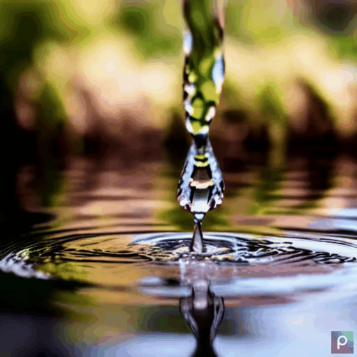

# Evaluating Text-to-Video Models

### Examples from [Text2Video-Zero model](https://github.com/Picsart-AI-Research/Text2Video-Zero?tab=readme-ov-file)
<table>
  <tr>
    <td></td>
    <td></td>
    <td></td>
    <td></td>
    <td></td>
  </tr>
</table>

This project represents a convergence of machine learning, video and image processing, and natural language processing (NLP) in pursuit of a novel and innovative quality evaluation metric for video output from text-to-video models. The project combines a custom-built image naturalness and human interpretability classifier with advanced text similarity techniques to produce more precise and dependable performance scores. This initiative employs the latest state-of-the-art image generation and processing technology to enhance user experience and elevate quality of generated videos.

## About the Project

This project can be broken down into four main parts, the first is the Text-to-Video (T2V) algorithms, these are used to generate new videos based on a text prompt. This is followed by a Video-to-Text (V2T) model that is used to generate captions for the aforementioned generated videos. A combination of tools are then used to analysis the video naturalism and the semantic matching. 

The code for the T2V models can be found in the directory [T2V Models](T2V_models), this includes instructuctions on how to setup the neccessary enviroment and how to run each of the models that we use for evaluation.  

The next part is the V2T model this is stored in [Video Caption Generator](video_caption_generator) directory, the model that we use is BLIP, we use it to generate a caption for each frame in a video for further analysis.

The metric workflow shown above, can be divided into two parts.
The first part involves data generation, depicted in blue and yellow boxes on the left-hand side of the figure. Starting with an initial text prompt, we generate a video using a T2V model. Then, we use the generated video to produce a list of captions using BLIP-2.
The second part involves the ensemble of two metrics, which starts with the Text Similarity Metric presented in [Textal Semantic Similarity](Textual_Semantic_Similarity). This metric calculates the similarity score between the original text prompt and the BLIP-generated captions, ranging from 0 to 1. Next, we use the Naturalness Metric described in [Video Naturalness](Video_Naturalness) section, a customised XGBoost classifier that takes the generated video as input and outputs a score ranging from 0 to 1.

---
## Project Highlights
The study highlights the constraints of the current evaluation metrics used in the literature, identifying the need for a new evaluation metric that addresses these limitations. Our main contribution is a proposed evaluation metric which involves addressing two critical challenges: image naturalness and semantic matching. Our research demonstrates that the novel metric [Title](cid:3437%252AE95BD0FC-C10E-44FF-BB5F-9431E4530AA1)outperforms a commonly used metric, indicating that it is a reliable and valid evaluation tool.

### Results
In this section we provide some generated videos with captions thier captions, that were used to generate them alongside with the breakdown of the results that were calculated as part of our metric. 


<table>
  <tr>
    <td style="text-align:center">
      
      <br>A snow leopard camouflaged among the snowy peaks of the Himalayas.<br>Naturalness Score: 0.9<br>Text Matching Score: 0.79
    </td>
    <td style="text-align:center">
      
      <br>Counting down in Times Square excitement fills the air.<br>Naturalness Score: 0.90<br>Text Matching Score: 0.60
    </td>
    <td style="text-align:center">
      
      <br>A drammatic thunderstorm with lightning illuminating the dark sky and rain pouring down in torrents.<br>Naturalness Score: 0.43 <br>Text Matching Score: 0.69 <br>
    </td>
  </tr>
  <tr>
    <td style="text-align:center">
      
      <br>Ballet dancers gracefully twirled outside the Sydney Opera House.<br>Naturalness Score: 0.72<br>Text Matching Score: 0.76
    </td>
    <td style="text-align:center">
      
      <br>A roaring lion standing proudly on a rocky outcrop.<br>Naturalness Score: 0.5<br>
Text Matching Score: 0.74
    </td>
    <td style="text-align:center">
      
      <br>A puppy learning to walk.<br>Naturalness Score: 0.33<br>Text Matching Score: 0.43
    </td>
  </tr>
</table>

---
### Recommended Steps:

1. SSH into a GPU (Needed to run T2V models)
2. Create a Docker Image using the "./Dockerfile"
    1. Configure {PORT1} for the notebook
3. Run image by running the script "./run_image.sh"
    1. Configure {PORT1}, {PORT2} to port forward the notebook and {UID} to create multiple containers from one image.
3. When the Docker Container is running:
    1. Run the file [setup.sh](setup.sh).
4. To create new videos using the T2V models:
    1. Go to the "./T2V_models/$MODEL_TYPE" directory
    2. Then run a model of your choice using the instructions inside the README.md file.
5. Generate captions for the videos with the "./video_caption_generator" directory.
    1. This model uses BLIP to generate captions for each frame in a video.
    2. The sets to use the model can be found inside the README.md file.
6. Generate Text Similarity Score by running [text_similarity.py](Textual_Semantic_Similarity/text_similarity.py)
7. Generate Image Naturalness score by following instructions from [Video_Naturalness](Video_Naturalness)

---
## Project Directory Structure
A majority of the directories include a more detailed README.md that explains how to run the code and what it is used for.
They also included a ./setup.sh script if they are needed to run the code.
```
./
├── .git
├── .gitignore
├── T2V_models
|    └── $MODEL_TYPE (A directory for each T2V model used)
|        └── Model script (The Python code used to run the model)
├── Textual_Semantic_Similarity
|    └── text_similarity.py (Python script to calculate a textual semantic similarity for a generated video)
├── Video_Naturalness
|    └── Classifier (A folder that containes experiments and trained classifiers for image naturalness detection)
|    └── Inception (**Philip**)
|    └── image_statistics.py (Python script with functions to extract statistical properties of an image)
|    └── video_processing.py (Python script to generate naturalness scores for videos)
├── video_caption_generator
|    ├── video_caption_generator.py (Generates captions for the frames of videos)
|    └── video_captions.json (All the videos captions are stored here)
├── Dockerfile (Used to create the Docker Image used to run the code)
├── run_image.sh (Used to create the Docker Container)
└── setup.sh (used to create the inital enviroment needed to run all the code)

```
 
